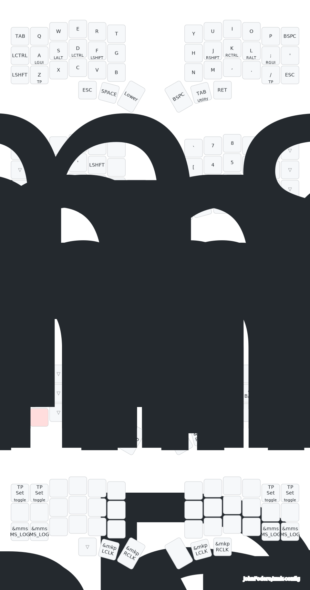

# Trackpoint Chocofi

ZMK Config for a [Beekeeb Chocofi](https://shop.beekeeb.com/product/presoldered-chocofi-split-keyboard/?srsltid=AfmBOorOUkOTzw1I_VZ3Z22cdyD2wuMoCGy5-2uvoH9O_egl5vW5NNeG) with [Holykeebs trackpoint module](https://holykeebs.com/products/trackpoint-module).

This is a combination of Urobs awesome ZMK contributions and Infused-Kim's work on supporting trackpoint devices.
Credit to [Urobs Repo](https://github.com/urob/zmk-config/tree/main) for:
- Nix local build environment
- Justfile

Infused-kim for:
- Trackpoint [config](https://github.com/infused-kim/kb_zmk_ps2_mouse_trackpoint_driver-zmk_config) (this is a fork of their repo), including scroll features
- Trackpoint [driver](https://github.com/infused-kim/kb_zmk_ps2_mouse_trackpoint_driver/)

I'm currently using the [KLP Lame](https://github.com/braindefender/KLP-Lame-Keycaps) 3d printed keycaps (in resin). 

See the [Todo](todo.md) page for changes/feature support.

# Keymap
